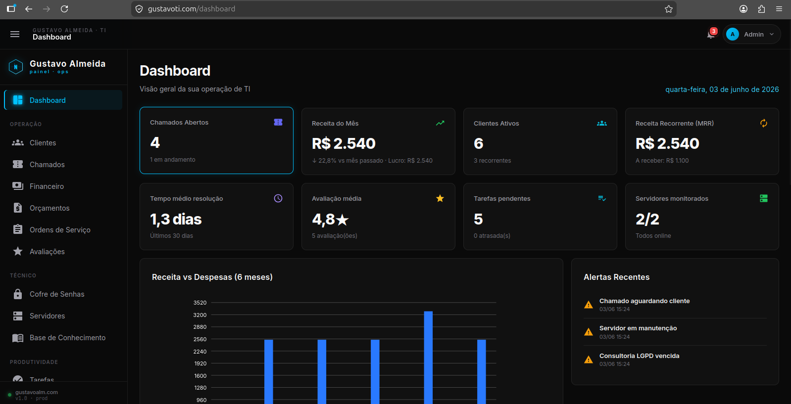
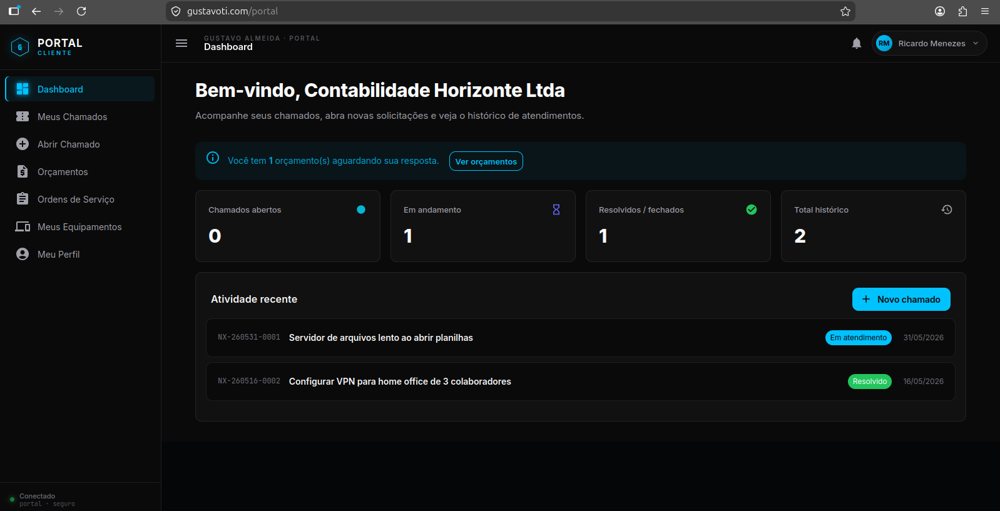
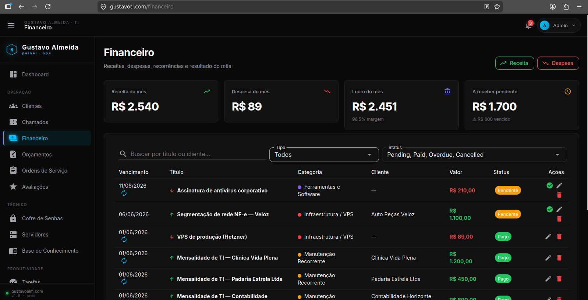
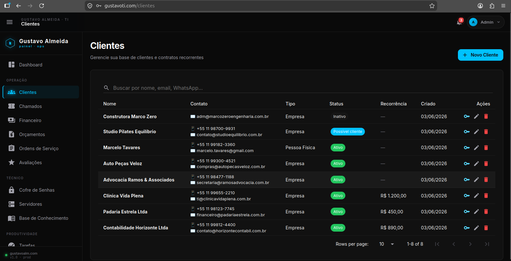
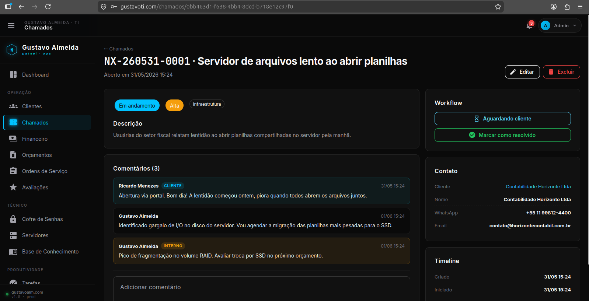
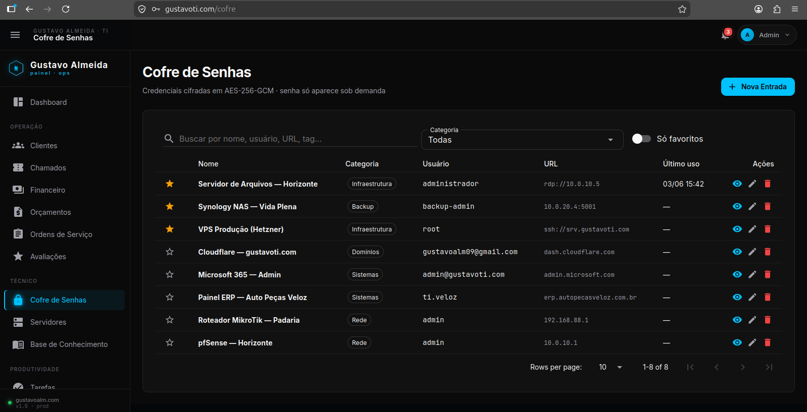
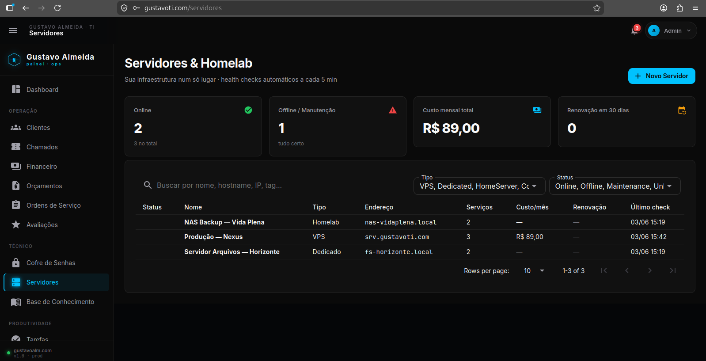
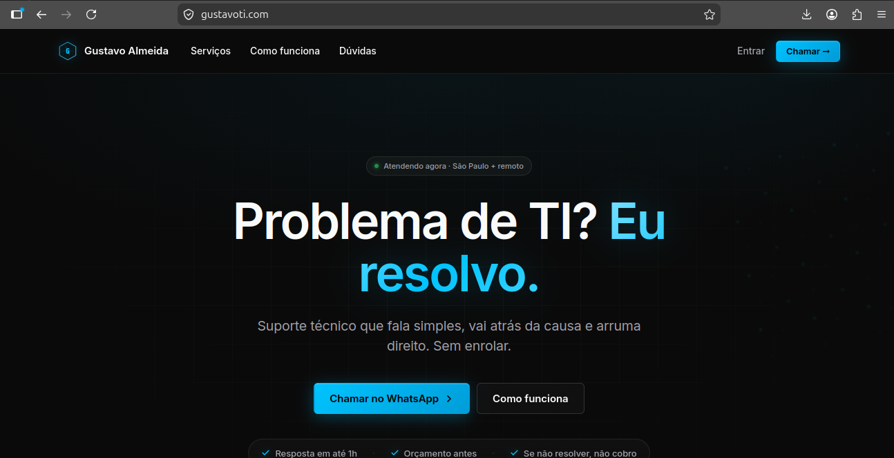
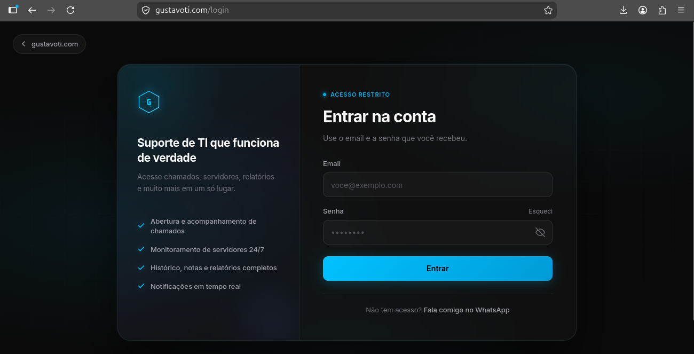
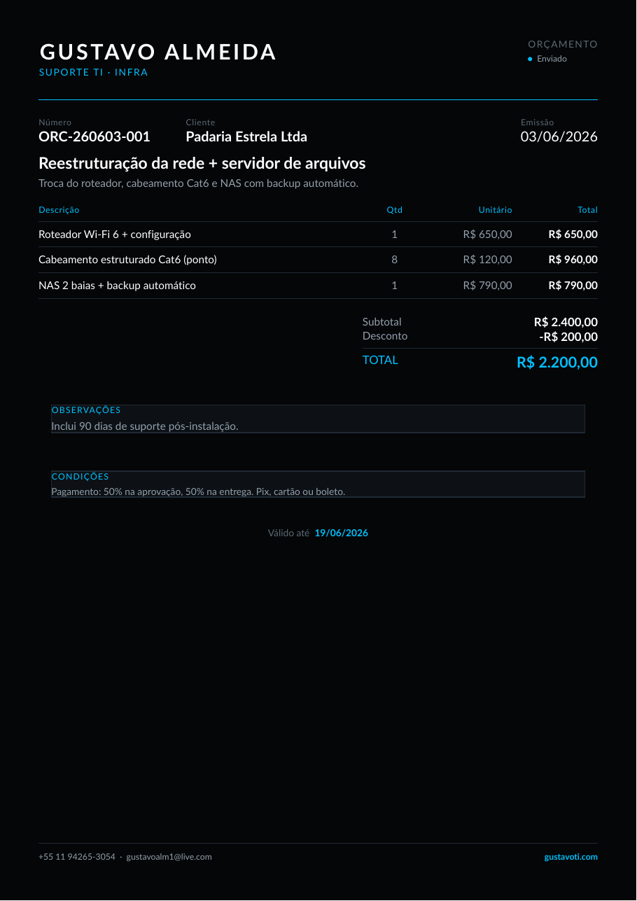

# Nexus — Sistema Operacional Técnico

> CRM + portal do cliente + painel operacional para um negócio de suporte de TI — full-stack, em produção, servindo clientes reais.

[](https://github.com/gusta-ve/nexus-showcase/actions/workflows/tests.yml)


**🚀 No ar:** **[gustavoti.com](https://gustavoti.com)** · Hetzner · HTTPS automático (Let's Encrypt) · deploy contínuo a cada push

**🟢 Demo ao vivo (login aberto):** **[demo.gustavoti.com](https://demo.gustavoti.com)** — explore o painel administrativo e o portal do cliente com dados fictícios. As credenciais de acesso aparecem na própria tela de login.

Plataforma operacional de TI com três frentes: **landing pública** pra clientes leigos, **portal do cliente** isolado por dados, e **painel administrativo** completo — CRM, chamados, financeiro, cofre de senhas, servidores, tarefas, notas, orçamentos e OS com PDF. Arquitetado para evoluir até SaaS.

## ✨ Destaques de engenharia

- **Multi-tenant com isolamento real** — o portal filtra todo dado pelo `clientId` derivado do login no servidor (nunca de input do cliente); detalhe e mutação usam filtro duplo `id + clientId`, e até o PDF valida posse antes de renderizar. Auditado, sem IDOR.
- **Cofre de senhas com AES-256-GCM autenticado** — nonce aleatório por operação, tag de integridade, chave fora do código (env).
- **Clean Architecture** — Domain / Application / Infrastructure / Web, com `Result<T>`, repositórios genéricos, soft-delete global e auditoria automática via interceptor do EF.
- **Real-time sem SignalR cliente** — dispatcher in-memory sobre o próprio circuit do Blazor Server (sino de notificações, alerta de servidor offline em tempo real).
- **Login endurecido** — antiforgery (CSRF), rate limiting, lockout e cookie `HttpOnly`/`Secure`/`SameSite`; security headers no edge (Caddy) + app.
- **CI/CD de verdade** — push na `main` → GitHub Actions → SSH no servidor → rebuild Docker → no ar em ~1 min.
- **Testado onde importa** — suíte cobrindo o round-trip do cofre (AES-256-GCM) e o **isolamento multi-tenant** (prova em teste que um cliente não acessa dado de outro), rodando no CI.

## 🔒 Segurança

Segurança e disponibilidade foram requisito desde o primeiro commit, não um "depois". O que está implementado na aplicação:

- **Autenticação & sessão** — ASP.NET Identity com roles (`Admin`/`Technician`/`Client`), toda rota exige autorização. Login endurecido: **antiforgery (CSRF)**, **rate limiting**, **lockout** por tentativas e erro genérico (sem enumeração de usuário). Cookie `HttpOnly` + `Secure` + `SameSite`.
- **Isolamento multi-tenant (sem IDOR)** — o `clientId` é derivado do login **no servidor**, nunca vem do request; leitura e mutação no portal usam filtro duplo `id + clientId`, e até o PDF valida posse antes de renderizar. Coberto por teste automatizado.
- **Criptografia** — cofre de senhas em **AES-256-GCM autenticado** (nonce aleatório por operação + tag de integridade); chave fora do código, em variável de ambiente.
- **Headers de segurança** — `Content-Security-Policy`, `Permissions-Policy`, HSTS, `X-Frame-Options`, `X-Content-Type-Options` e `Referrer-Policy`.
- **Anti-SSRF** — o monitor de servidores resolve o host antes de sondar e **recusa loopback, link-local e metadata de cloud** (ex: `169.254.169.254`); faixas privadas são bloqueadas na instância pública de demo.
- **Sem SQLi/XSS** — EF Core parametriza tudo (sem SQL cru); Blazor escapa a saída (sem `Html.Raw` com dado de usuário).
- **Segredos fora do código** — tudo em `.env` (git-ignored); a senha do admin é obrigatória, sem default. A [demo pública](https://demo.gustavoti.com) roda **isolada** (banco e instância próprios), com `noindex` e reset periódico.

---

## 📸 Telas

### Painel administrativo
O cockpit da operação: receita do mês, MRR, chamados, avaliação, monitoramento de servidores, gráfico de 6 meses e alertas — com todos os módulos na lateral.



### Portal do cliente — isolamento multi-tenant
Cada cliente acessa um portal próprio e **só enxerga os próprios dados** (chamados, orçamentos, ordens de serviço, equipamentos). O `clientId` é derivado do servidor a partir da sessão, nunca vem do request — provado por [testes automatizados](tests/).



### Gestão financeira
Receitas, despesas, recorrências (MRR) e resultado do mês, com categorias coloridas e status (pago / pendente / vencido).



| Clientes — CRM | Chamado — atendimento |
|:---:|:---:|
|  |  |
| Carteira com tipo, status, recorrência e tags | Timeline cliente ↔ técnico, com notas internas |

| Cofre de senhas | Servidores & homelab |
|:---:|:---:|
|  |  |
| AES-256-GCM autenticado, senha só sob demanda | Inventário de infra com health check automático |

| Landing pública | Login |
|:---:|:---:|
|  |  |

**Documento de negócio** — orçamentos e ordens de serviço gerados em PDF com a identidade da marca (QuestPDF):

<p align="center"></p>

## Marca dupla

| Frente | Marca exibida | Público | Tom |
|---|---|---|---|
| Landing pública (`/`) | **Gustavo Almeida · Suporte TI · Infra** | Visitantes / leads não-tech | Resend-style: cinza neutro, peso forte sem CAPS, ciano só como acento, WhatsApp em destaque |
| Login (`/login`) | **Gustavo Almeida** | Clientes + Admin | Single-column 400px, mesma estética da landing |
| Portal do Cliente (`/portal/*`) | **Gustavo Almeida · Portal do Cliente** | Clientes contratados | Sistema profissional, sóbrio |
| Painel Admin (`/dashboard`, `/clientes`, ...) | **Nexus · Operations** | Apenas Admin/Technician | Cockpit técnico, denso |

Repositório, namespaces e infra continuam `Nexus.*` — a marca dupla é só apresentação.

## Stack

| Camada | Tecnologia |
|---|---|
| Backend | .NET 10 · ASP.NET Core · Blazor Server (`InteractiveServer` global via Routes) |
| UI | MudBlazor 9 · CSS custom (cinza neutro `#0a0a0a` + off-white `#fafafa` + ciano elétrico `#00c2ff` como acento) |
| Tipografia | Inter peso 400-800 (UI e landing — sem CAPS no h1/h2, peso forte faz o trabalho) · Saira Condensed (variante `.nx-display-caps` legada, admin only) · JetBrains Mono (código e números) |
| Design system | Tokens em `:root` (`--nx-bg`, `--nx-text`, `--nx-border`, etc); classes `.lp4-*` (landing v4) e `.auth4-*` (login v4); admin/portal ainda usam classes `.nexus-*` (v3) |
| Banco | **PostgreSQL 16** · EF Core 10 (migrations automáticas no startup) |
| Auth | ASP.NET Identity · cookie HTTPS-only · roles `Admin`/`Technician`/`Client` |
| PDF | QuestPDF 2026 (Community License) — gera Orçamentos e OS com brand |
| Background workers | `ServerHealthCheckWorker` (ping HTTP/TCP a cada 5 min, dispara alert + push real-time na transição online→offline) |
| Real-time | `InMemoryRealtimeNotifier` singleton — dispatcher de eventos pra componentes do circuit Blazor (sem SignalR cliente, sem WebSocket extra) |
| Email transacional | `SmtpEmailService` — env-gated por `Email__Enabled`. Sem config, falha silenciosa (não derruba app). Dispara em `Alert.ServerDown` e `ClientWaiting` |
| WhatsApp transacional | `ZApiWhatsAppService` (Z-API) — env-gated por `WhatsApp__Enabled`. Mesma política de falha silenciosa |
| Reverse proxy / TLS | Caddy 2 (Let's Encrypt automático) |
| Logs | Serilog (console + arquivo, rotação diária) |
| Backup | `docker/backup.sh` via cron diário (03:10 UTC, retenção 7 dias). `nexus-status` lê `.last_success` pra mostrar idade do último backup |
| Infra | Docker · Docker Compose |

## Arquitetura — Clean Architecture

```
src/
├── Nexus.Domain          Entidades, enums, ISoftDeletable, AuditableEntity, domain events
├── Nexus.Application     Result<T>, IRepository<T>, IUnitOfWork, Features/* (services + DTOs por módulo)
├── Nexus.Infrastructure  NexusDbContext, EF configs, repos, criptografia, seed, hosted workers
└── Nexus.Web             Blazor Server, layouts, páginas, MudBlazor theme, endpoints (auth + docs PDF)
```

### Decisões-chave

- **Render mode no `<Routes>`, não no layout** — `@rendermode="InteractiveServer"` aplicado uma vez no `App.razor`; layouts e pages herdam (aplicar no layout quebra a serialização do `Body`).
- **Real-time sem SignalR cliente** — `InMemoryRealtimeNotifier` (singleton) publica eventos pros componentes do circuit Blazor; o sino assina os buckets do user/roles. Como o Blazor Server já mantém um WebSocket por usuário, não precisa de SignalR extra.
- **Soft-delete global + auditoria automática** — `ISoftDeletable` com query filter global e um `SaveChangesInterceptor` preenchendo `CreatedAt`/`UpdatedAt`/`CreatedBy`/`UpdatedBy`.
- **Login prerender + interactive** — `PersistentComponentState` carrega o token antiforgery do prerender pro re-render interativo (o `HttpContext` só existe no prerender).
- **Health check em background** — `BackgroundService` sonda os servidores (HTTP/TCP), atualiza status e cria `Alert.ServerDown` na transição online→offline.
- **PDF brand-aware** — `QuotePdfGenerator`/`ServiceOrderPdfGenerator` com a identidade da marca, em endpoint autenticado que valida posse antes de renderizar.

## Módulos implementados

| Módulo | Rota | Status |
|---|---|---|
| Landing pública (humanizada, cliente leigo, abre chamado) | `/` | ✅ |
| Dashboard admin (KPIs + gráficos receita/despesa) | `/dashboard` | ✅ |
| CRM Clientes (CRUD + criar acesso ao portal) | `/clientes` | ✅ |
| Chamados (lista + detalhe + workflow + comentários interno/público) | `/chamados`, `/chamados/{id}` | ✅ |
| Financeiro (KPIs do mês + lançamentos + recorrência + marcar pago) | `/financeiro` | ✅ |
| Cofre de Senhas (AES-256-GCM + reveal com auto-close 60s + gerador) | `/cofre` | ✅ |
| Servidores / Homelab (CRUD + serviços + health check automático) | `/servidores`, `/servidores/{id}` | ✅ |
| Tarefas (prioridade/status/vencimento + toggle done) | `/tarefas` | ✅ |
| Notas (grid de cards coloridos + pinned + arquivar) | `/notas` | ✅ |
| Orçamentos (itens inline + recálculo + PDF brand) | `/orcamentos`, `/orcamentos/{id}` | ✅ |
| Ordens de Serviço (checklist + valores + PDF assinável) | `/ordens-servico`, `/ordens-servico/{id}` | ✅ |
| Portal do Cliente (chamados, **orçamentos com aprovar/recusar**, **OS**, **equipamentos**, perfil) | `/portal/*` | ✅ |
| Base de Conhecimento (runbooks/snippets com tags + busca + copiar) | `/conhecimento` | ✅ |
| Notificações real-time (sino com badge + toast curto + dispatcher in-memory) | sino no header | ✅ |
| Email + WhatsApp transacional (env-gated, dispara em alerts críticos) | — | ✅ (código pronto, ativação por env) |
| Backup automatizado do banco (cron diário + retenção + monitor) | — | ✅ (scripts em `docker/`) |
| Avaliações de cliente (1-5 estrelas + comentário, dispara alert se ≤2; cliente avalia no detalhe do chamado, admin vê lista) | `/avaliacoes` + `/portal/chamados/{id}` | ✅ |
| Automações (webhooks n8n + AutomationLog UI) | — | 🔲 |
| Multi-tenant + RBAC granular | — | 🔲 |

## Rodando localmente

```bash
cp .env.example .env       # ajuste os valores
docker compose up -d --build
```

## License

Privado.
